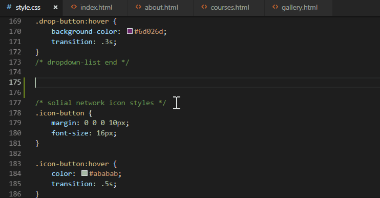

# HTML to CSS completion suggestions

Default settings are set to `html`/`php` >> `css`/`scss`/`less`/`sass`/`stylus` flow.  
To change file types you want to get selectors from use `HTML to CSS autocompletion` extension configuration from `command palette` or VSCode `user settings`.

## Extension features

- Intellisense suggestions/completions for `classes` and `ids` from `markup` documents to `CSS`, `SCSS`, `Less`, `Sass`, `Stylus` stylesheets
- Configuration of `file types`, `files`, `folders` or `workspaces` to work with

## How to configure

- Enter `HTML to CSS autocompletion: Extension Configuration` from the command palette
- Or find `html-to-css-autocompletion` configuration entries in VSCode user settings

## Configuration options

- `html-to-css-autocompletion.triggerCharacters`
  Shows completion list only on '#'/'.' character entries. Default: `disable`

- `html-to-css-autocompletion.autocompletionFilesScope`  
  Defines scope for extension to work with. `Options`:  
  `multi-root`: all selectors found within all root folders will be visible to defined stylesheets. This is `Default` autocompletion provider's scope.  
  `workspace`: all selectors found within particular workspace folder/project will be visible to stylesheets within that workspace folder.  
  `linked files`: selectors will be provided only for linked stylesheets.

- `html-to-css-autocompletion.getSelectorsFromFileTypes`  
  Defines file types to be searched for classes and ids. Default: `html, php`

- `html-to-css-autocompletion.folderNamesToBeIncluded`  
  Defines only specific folder names to be searched. Default: `''`

- `html-to-css-autocompletion.folderNamesToBeExcluded`  
  Defines folder names to be excluded from being searched. Default: `node_modules`

- `html-to-css-autocompletion.includePattern`  
  Set custom glob pattern to get classes/ids from matched files. E.g.: `**/{folderName1,folderName2,...}/*.{fileType1,fileType2,...}`

- `html-to-css-autocompletion.excludePattern`  
  Set custom glob pattern to exclude search on pattern matches. E.g.: `**/{folderName1,folderName2,...}/**`
